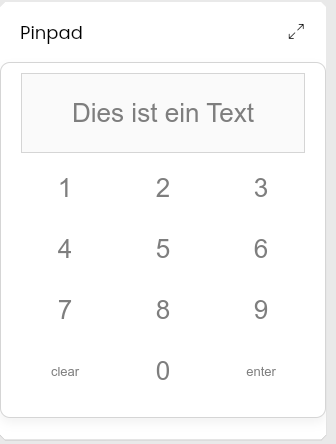
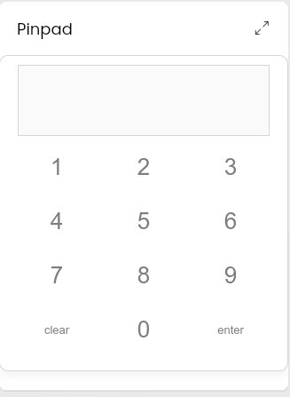
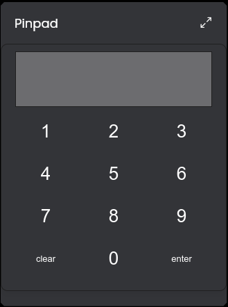

### IP-Symcon Modul Library: Pinpad für die Kachelvisu
 
Diese Modul stellt ein Pinpad in der TileVisu dar. Es wird eine Variable erstellt und diese nach Eingabe von "enter" geschrieben

Die Nutzung des Moduls geschieht auf eigene Gefahr ohne Gewähr. Es handelt sich hierbei um einen frühen Entwicklungsstand.

## Dokumentation

**Inhaltsverzeichnis**

1. [Funktionsumfang](#1-funktionsumfang) 
2. [Systemanforderungen](#2-systemanforderungen)
3. [Installation](#3-installation)
4. [Statusvariablen und Profile](#4-statusvariablen-und-profile)
5. [PHP-Befehlsreferenz](#5-php-befehlsreferenz)
6. [Symcon Kachel](#6-symcon-kachel)

## 1. Funktionsumfang

Es wird eine Variable "PinID" erstellt und diese nach druck des "enter"-Buttons geschrieben. Mithilfe dieser Pin kann bspw. ein "ausgelöstes Ereignis" erstellt werden, der eine Alarmanlage o.ä. un/scharf schaltet

## 2. Systemanforderungen
- Symcon ab Version 7.1

## 3. Installation

* Über den Module Store das 'PinPad'-Modul installieren.

 Unter 'Instanz hinzufügen' kann die 'Pinpad für die Kachelvisu'-Instanz mithilfe des Schnellfilters gefunden werden.  
	- Weitere Informationen zum Hinzufügen von Instanzen in der [Dokumentation der Instanzen](https://www.symcon.de/service/dokumentation/konzepte/instanzen/#Instanz_hinzufügen)

## 4. Statusvariablen und Profile
- das Modul erstellt keine Profile und nur eine Variable

Name          				     | Beschreibung
-------------------------------- | -------------------------------------------------------
Pin | die gesendete Pin

## 5. PHP-Befehlsreferenz

`PINPAD_sendText(int $InstanzID, string $Text, int $sekunden);`

erlaubt das senden eines Textes zum Pinpad. Diese wird in der Kachel angzeigt.

Beispiel:

`PINPAD_sendText(12345, "Dies ist ein Text", 3);`

sendet o.a. Text und zeigt es 3 sek. an.

## 6. Symcon Kachel

Die Pinpad-Kachel hat neben einem Light- auch einen Darkmode, je nachdem wie Ihr eure Visu eingerichtet habt:

Lightmode

Darkmode

